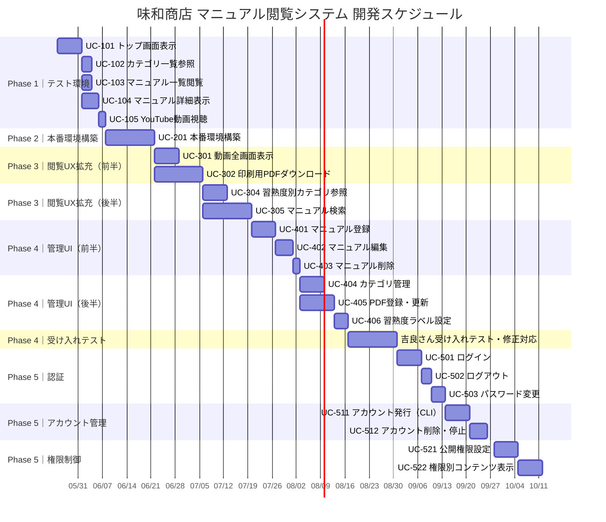

# プロジェクトスケジュール

**プロジェクト**: 味和商店 マニュアル閲覧システム
**作成日**: 2026-05-15
**作成者**: 喜多亮介
**スプリント単位**: 2週間

---

## ガントチャート

---

## スプリント計画

| スプリント     | 期間                 | フェーズ           | 対象 UC          | 目標                 |
| --------- | ------------------ | -------------- | -------------- | ------------------ |
| Sprint 1  | 2026-05-25 〜 06-07 | Phase 1        | UC-101〜105     | テスト環境でマニュアル閲覧を実現する |
| Sprint 2  | 2026-06-08 〜 06-21 | Phase 2        | UC-201         | 本番公開できる状態にする       |
| Sprint 3  | 2026-06-22 〜 07-05 | Phase 3（前半）    | UC-301, UC-302 | 全画面・PDF対応          |
| Sprint 4  | 2026-07-06 〜 07-19 | Phase 3（後半）    | UC-304, UC-305 | 難易度フィルタ・検索         |
| Sprint 5  | 2026-07-20 〜 08-02 | Phase 4（前半）    | UC-401〜403     | マニュアル登録/更新/削除      |
| Sprint 6  | 2026-08-03 〜 08-16 | Phase 4（後半）    | UC-404〜406     | カテゴリ・PDF・難易度ラベル管理  |
| Sprint 7  | 2026-08-17 〜 08-30 | Phase 4（検収）    | —              | 吉良さん受け入れテスト・修正対応   |
| Sprint 8  | 2026-08-31 〜 09-13 | Phase 5（認証）    | UC-501〜503     | ログイン・ログアウト・PW変更    |
| Sprint 9  | 2026-09-14 〜 09-27 | Phase 5（アカウント） | UC-511〜512     | アカウント発行・削除         |
| Sprint 10 | 2026-09-28 〜 10-11 | Phase 5（権限）    | UC-521〜522     | マニュアル公開範囲制御・権限別表示  |

**総期間**: 約5.5ヶ月（2026-05-25 〜 2026-10-11）

---

## マイルストーン

| マイルストーン       | 目標日        | 内容                          |
| ------------- | ---------- | --------------------------- |
| M1: テスト環境公開   | 2026-06-07 | スタッフが動画・テキストマニュアルを閲覧できる     |
| M2: 本番公開      | 2026-06-21 | 現場スタッフが実際にアクセスできる           |
| M3: 閲覧UX完成    | 2026-07-19 | 全画面表示・PDFダウンロード・検索・難易度ラベル対応 |
| M4: 管理UI完成・検収 | 2026-08-30 | 吉良さんがコンテンツを自走で管理/運用できる      |
| M5: 認証・権限管理完成 | 2026-10-11 | ログイン必須・店舗単位のアクセス制御          |

---

## エンハンス（別途スケジュール調整）

Phase 5完成後に優先度・スケジュールを別途検討。

- UC-E00: 管理者ロール分割
- UC-E01〜E02: アカウント管理UI
- UC-E11〜E13: 連絡事項機能
- UC-E20〜E20a: 画像付き工程テキスト
- UC-E21: 多言語対応

